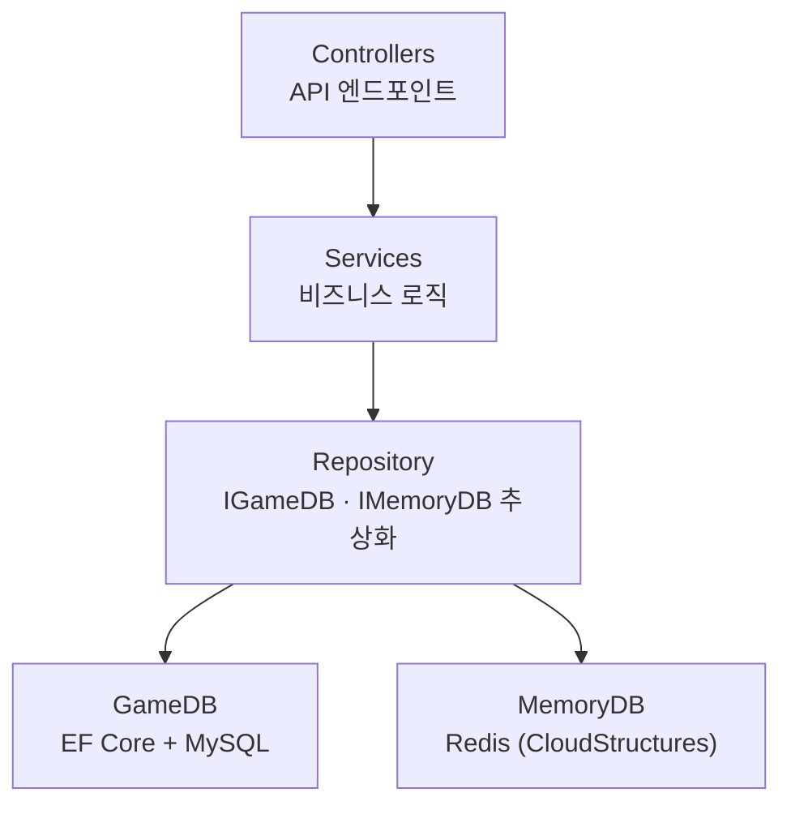

<div align="center">

# HGame01 Game Server

**Action Roguelike RPG — 게임 백엔드 API 서버**

[](https://dotnet.microsoft.com/) [](#) [](#) [](#) [](#)

</div>

---

이 저장소는 Unity 클라이언트 [**HGame01**](https://github.com/hhyeon0306/HGame01) 과 연동되는
**ASP.NET Core 8.0 게임 백엔드**입니다. 토큰 기반 인증 REST API이며, 모든 게임 재화·진행
상태의 **권위(authority)는 서버**가 가집니다 — 클라이언트는 표시만 하고 재계산하지 않습니다.

> 클라이언트의 네트워크 연동 상세는 클라 저장소의
> [**챕터 05 · Client - Server 아키텍처**](https://github.com/hhyeon0306/HGame01/blob/main/Docs/Chapters/05-client-server.md) 문서를 함께 보시면 양쪽 흐름이 이어집니다.

---

## 🏗 아키텍처



| 계층 | 책임 |
|:--|:--|
| **Controllers** | 도메인별 API 엔드포인트. 요청 검증 + DTO 변환만 (얇게 유지) |
| **Services** | 게임 규칙·정산·검증 등 비즈니스 로직의 단일 소유처 |
| **Repository** | `IGameDB` / `IMemoryDB` 인터페이스로 영속성 추상화 |
| **GameDB / MemoryDB** | MySQL(영속 데이터) / Redis(세션·인증 토큰·캐시) |

요청은 항상 `Controller → Service → Repository → DB` 한 방향으로만 흐릅니다. 컨트롤러는
요청을 받아 인증된 유저를 꺼내고 곧바로 Service에 넘기며, 게임 규칙·정산·트랜잭션은
모두 Service 한 곳에서만 일어납니다.

---

## 🔐 인증 흐름

1. `POST /api/Login` → 서버가 랜덤 토큰 생성, Redis에 저장 (TTL 24시간)
2. 클라이언트는 이후 모든 요청에 `profileid` · `authtoken` 헤더 포함
3. `CheckUserAuthAndLoadUserData` 미들웨어가 토큰을 검증하고, 유효하면
   유저 데이터를 `HttpContext.Items` 에 주입 → 컨트롤러는 인증된 유저로 시작
4. 인증 스킵 경로: `/api/Login`, `/api/CreateAccount`, `/api/Admin`

```csharp
// CheckUserAuthAndLoadUserData.cs — 모든 보호 엔드포인트의 단일 인증 게이트
(bool isOk, MdbUserData userInfo) = await _memoryDB.GetUserAsync(profileId);
if (isOk == false)
{
    await ResponseInvalidUserAuthToken(context);   // 401
    return;
}

context.Items[nameof(MdbUserData)] = userInfo;     // 컨트롤러가 꺼내 씀
await _next(context);
```

> 전체 코드: [HGame01Server/Middleware/CheckUserAuthAndLoadUserData.cs](https://github.com/hhyeon0306/HGame01Server/blob/main/HGame01Server/Middleware/CheckUserAuthAndLoadUserData.cs)

---

## 🤝 클라이언트와의 계약

클라이언트 `ServerAPI` 의 메서드와 서버 컨트롤러 액션은 **1:1로 대응**되며,
요청/응답 DTO(`Pk*Request` / `Pk*Response`)는 양쪽이 **같은 JSON 형태**를 공유합니다.

| 클라 `ServerAPI` | HTTP | 서버 |
|:--|:--|:--|
| `GetDailyShopList()` | `POST /api/Shop/DailyList` | `ShopController.DailyList` → `ShopService` |
| `BuyShopItem(tag)` | `POST /api/Shop/Buy` | `ShopController.Buy` → `ShopService` |
| `GachaPull(count)` | `POST /api/Gacha/Pull` | `GachaController` → `GachaService` |
| `Login(profileId)` | `POST /api/Login` | `LoginController` (인증 불필요) |

캐릭터·아이템 식별자는 클라/서버 모두 **GameplayTag 이름(string)** 을 그대로 사용하므로
중간 변환 어댑터가 없습니다.

---

## 🛒 상점 구매 한 건 끝까지 따라가기

상품 하나를 사는 단순한 동작 안에 이 서버의 핵심 원칙이 모두 들어 있습니다 —
**서버가 가격·보상의 유일한 기준이고, 차감·지급·기록은 전부 실패하거나 전부 성공한다.**
일일 상점에서 재화로 사는 상품 1건을 요청부터 응답까지 따라가 보겠습니다.

**① 클라이언트는 "무엇을 살지"만 보냅니다.** 가격도 보상도 보내지 않습니다. 요청에는
상품을 가리키는 GameplayTag 이름(`ShopItemId`) 하나뿐입니다. 가격을 클라가 보내면
변조할 수 있으므로, 서버는 클라가 보낸 값을 신뢰하지 않습니다.

**② 인증 미들웨어가 먼저 거릅니다.** 위 인증 흐름의 게이트가 토큰을 검증하고
`MdbUserData` 를 `HttpContext.Items` 에 넣어 두므로, 컨트롤러는 "이미 인증된 유저"
상태에서 시작합니다.

**③ 컨트롤러는 위임만 합니다.** 인증된 유저에서 `uid` 를 꺼내고 곧바로 Service를
호출합니다. 게임 규칙은 컨트롤러에 한 줄도 없습니다.

```csharp
// ShopController.cs — 얇은 컨트롤러: uid 추출 + Service 위임
[HttpPost("Buy")]
public async Task<PkShopBuyResponse> Buy([FromHeader] HeaderDTO header, [FromBody] PkShopBuyRequest request)
{
    MdbUserData userInfo = (MdbUserData)HttpContext.Items[nameof(MdbUserData)]!;
    long uid = userInfo.UId;

    _logger.ZLogInformation($"[Shop/Buy] Uid:{uid}, ShopItemId:{request.ShopItemId}");

    return await _shopService.BuyItemAsync(uid, request.ShopItemId);
}
```

> 전체 코드: [HGame01Server/Controllers/ShopController.cs](https://github.com/hhyeon0306/HGame01Server/blob/main/HGame01Server/Controllers/ShopController.cs)

&nbsp;

**④ Service가 권위를 쥐고 트랜잭션으로 처리합니다.** 클라가 보낸 태그로 서버가
가진 상품 데이터(`GdbShopData`)를 직접 조회합니다 — 가격·보상·일일 한도의 기준은
오직 이 서버 데이터입니다. 그다음 차감·지급·기록을 하나의 DB 트랜잭션으로 묶습니다.

```csharp
// ShopService.BuyItemAsync — 서버 데이터가 가격·보상의 유일한 기준
var shopItem = shopItems?.FirstOrDefault(s => s.tag == shopItemTag);
if (shopItem == null)
{
    return new PkShopBuyResponse { Result = ErrorCode.ShopItemNotFound };
}

await using var transaction = await _context.Database.BeginTransactionAsync();
try
{
    // 일일 한도 검증 (Daily 탭) — 오늘 구매 횟수를 DB에서 직접 카운트
    if (shopItem.tab_type == "Daily")
    {
        var purchases = await _gameDB.GetPurchasesSinceAsync(uid, resetStr);
        int todayCount = purchases.Count(p => p.shopItemId == shopItemTag);
        int limit = shopItem.daily_limit > 0 ? shopItem.daily_limit : 1;
        if (todayCount >= limit)
        {
            return new PkShopBuyResponse { Result = ErrorCode.ShopItemAlreadyPurchased };
        }
    }

    // 재화 차감 → 보상 지급 → 구매 기록 (모두 같은 트랜잭션)
    var deductError = await _currencyService.DeductAsync(uid, costType, shopItem.price_amount);
    if (deductError != ErrorCode.None)
    {
        return new PkShopBuyResponse { Result = ErrorCode.ShopInsufficientCurrency };
    }
    var reward = await GrantRewardAsync(uid, shopItem);
    await _gameDB.AddPurchaseAsync(purchase);

    await transaction.CommitAsync();   // 여기서 한꺼번에 확정

    var response = new PkShopBuyResponse { Result = ErrorCode.None, Reward = reward };
    await _currencyService.PopulateCurrenciesAsync(response, uid);   // 최신 재화 동봉
    return response;
}
catch (Exception ex)
{
    _ = ex;
    await transaction.RollbackAsync();   // 차감·지급·기록 전부 원복
    return new PkShopBuyResponse { Result = ErrorCode.ShopBuyFailed };
}
```

> 전체 코드: [HGame01Server/Services/ShopService.cs](https://github.com/hhyeon0306/HGame01Server/blob/main/HGame01Server/Services/ShopService.cs)

&nbsp;

**⑤ 응답에는 최신 재화가 함께 담깁니다.** 커밋 후 `PopulateCurrenciesAsync` 가
정산이 끝난 보유 재화를 응답에 채워 보냅니다. 클라이언트는 이 값을 **그대로 표시**할
뿐 직접 빼고 더하지 않습니다. 중간에 어떤 단계라도 예외가 나면 `RollbackAsync` 가
차감·지급·기록을 전부 되돌리므로, "돈만 빠지고 아이템은 안 들어오는" 상태가
생기지 않습니다.

이 한 건의 흐름이 클라 저장소
[챕터 07 · 상점](https://github.com/hhyeon0306/HGame01/blob/main/Docs/Chapters/07-shop.md) 의
구매 UI와, [챕터 05 · Client - Server](https://github.com/hhyeon0306/HGame01/blob/main/Docs/Chapters/05-client-server.md) 의
요청/응답 계약과 그대로 이어집니다.

---

## 🗂 도메인 컨트롤러

`Account` · `UserInfo` · `Shop` · `Gacha` · `Equipment` · `EquipmentStorage` ·
`Mail` · `Quest` · `SeasonPass` · `Tutorial` — 각 도메인이 독립 컨트롤러 + 전용 Service로
분리되어 있습니다. `Admin` · `Cheat` 는 개발/운영 전용입니다.

---

## 🔄 게임 데이터 동기화

`game_data/` 의 JSON을 리플렉션으로 자동 로드하고, JSON 구조에서 C# 모델 클래스
(`Models/GameData/Gdb*.cs`)를 자동 생성합니다. 클라이언트의 ScriptableObject 데이터를
`POST /api/Admin/UploadGameData` 로 올리면 서버 모델이 갱신됩니다 — 클라가 데이터 원본,
서버는 검증·정산 기준으로 사용합니다.

---

## 🧰 기술 스택

- **ASP.NET Core 8.0** — REST API 호스트
- **Pomelo.EntityFrameworkCore.MySql** — MySQL EF Core 프로바이더 (영속 데이터)
- **CloudStructures** — Redis 래퍼 (세션·인증 토큰·캐시)
- **ZLogger** — 고성능 구조화 로깅 (JSON 파일 일별 롤링 + 콘솔)

---

## ▶ 빌드 및 실행

```bash
dotnet build
dotnet run --project HGame01Server          # http://localhost:5000

# EF Core 마이그레이션 (모델 변경 후)
dotnet ef migrations add <MigrationName> --project HGame01Server
dotnet ef database update --project HGame01Server
```

> 로컬 인프라는 MySQL · Redis 컨테이너를 사용합니다. 접속 정보는 환경 설정
> (`appsettings`)으로 주입하며, 자격 증명은 저장소에 포함하지 않습니다.
> API 수동 테스트는 `HGame01Server/HGame01Server.http` 파일을 사용합니다.
